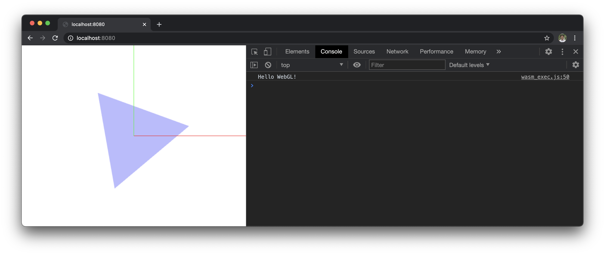
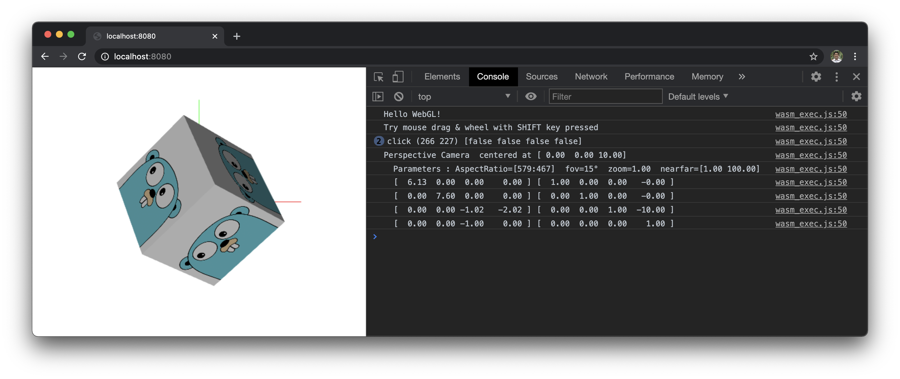
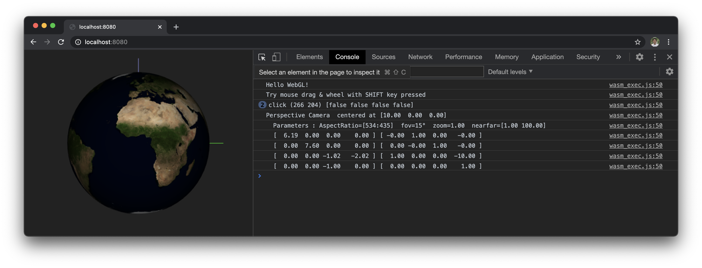

# GoWebGL : Interactive Graphics in Go

Interactive 2D & 3D Graphics Library using Go + WebAssembly + WebGL

## How to Build & Run

Simplest example: &emsp; _(for explaining how WebGL works)_
```bash
$ make                  # source : 'webgl1st_example.go'
$ ./wasm_test_server    # open your browser, and visit http://localhost:8080
```


2D example: &emsp; _(with animation & user interactions)_
```bash
$ make 2d               # source : 'webgl2d_example.go'
$ ./wasm_test_server    # open your browser, and visit http://localhost:8080
or
$ make 2dui             # source : 'webgl2d_ui_example.go'
$ ./wasm_test_server    # open your browser, and visit http://localhost:8080
```


3D example: &emsp; _(with perspective & orthographic camera)_
```bash
$ make 3d               # source : 'webgl3d_example.go'
$ ./wasm_test_server    # open your browser, and visit http://localhost:8080
```


Globe example: &emsp; _(with perspective & orthographic camera)_
```bash
$ make globe            # source : 'webglobe_example.go'
$ ./wasm_test_server    # open your browser, and visit http://localhost:8080
```


## ToDo List

- user selection using collision detection with a ray from camera
- dynamic switching of world map projections (Mercator, Stereographic, etc)
- graticules on the globe

## Thanks

I hope this project can help many people to learn WebGL and to build awesome 2D & 3D graphics applications.  
Many thanks to [Richard Musiol](https://github.com/neelance), for his vision and contributions for GopherJS and WebAssembly for Go.

Resources taken from:
- [Go Gopher images](https://golang.org/doc/gopher/) : originally created by Renee French
- [VisibleEarth by NASA](https://visibleearth.nasa.gov/collection/1484/blue-marble) : world satellite images
- [NaturalEarth](https://www.naturalearthdata.com/) : public domain map dataset
