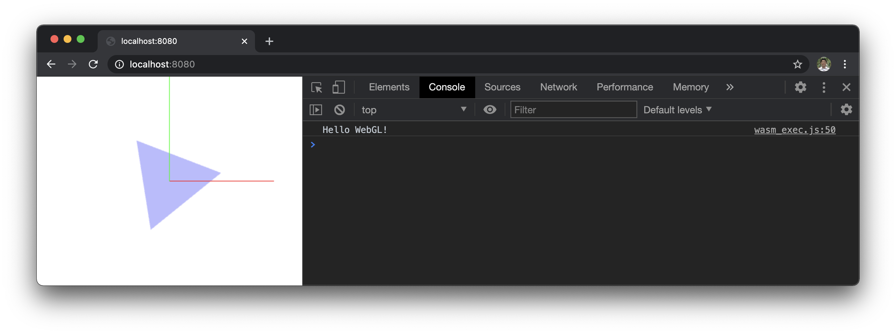

# GoWebGL : Interactive Graphics in Go

Interactive 2D & 3D Graphics Library using Go + WebAssembly + WebGL

## How to Build & Run

Simplest example: &emsp; _(for explaining how WebGL works)_
```bash
$ make                  #
$ ./wasm_test_server    # open your browser, and visit http://localhost:8080
```


2D example: &emsp; _(with animation & user interactions)_
```bash
$ make 2d               #
$ ./wasm_test_server    # open your browser, and visit http://localhost:8080
```


3D example: &emsp; _(with perspective & orthographic camera)_
```bash
$ make 3d               # 
$ ./wasm_test_server    # open your browser, and visit http://localhost:8080
```


## Thanks

I hope this project can help many people to learn WebGL and build awesome 2D & 3D graphics applications.
Many thanks to Richard Musiol(@neelance), for his vision and huge contributions for GopherJS and WebAssembly for Go.
